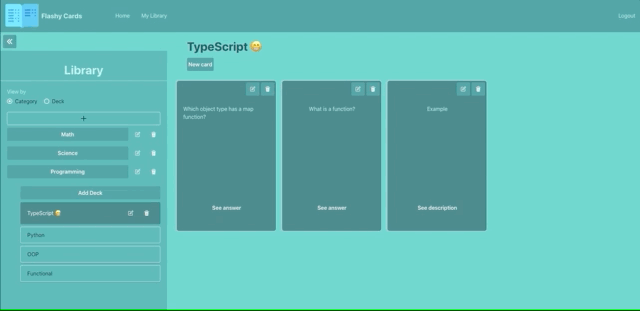

# Flashy Cards - Frontend

This repository contains the frontend for the Flashy Cards project. The main reason I created this project was to try out NestJS as my backend (which you can find in [this repository](https://github.com/jakewheeler/flashcard-backend)) as well as experiment with react-query for a lot of my state management needs.

## Tech

Some of the frontend technologies I used include:

- create-react-app
- react-query
- Zustand
- TypeScript
- axios
- react-hook-form
- react-card-flip
- Chakra UI
